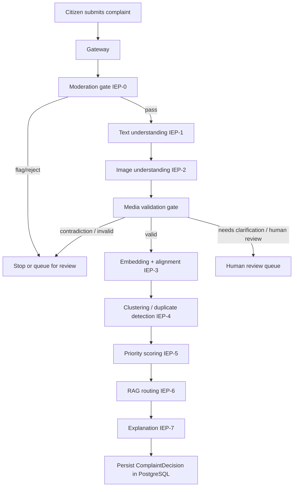

# CedarFix AI - Current System Design

This document describes the current live architecture of CedarFix AI as implemented in the codebase.
It focuses on the active request flow, what each service does, how text/image requests are processed,
how embeddings and routing work today, what is stored in PostgreSQL versus Docker volumes, and how the
admin feedback loop operates.

## 1. Purpose

CedarFix AI is a Lebanese public infrastructure complaint platform. A citizen submits a complaint with:

- text only
- image only, or
- both text and image

The platform then:

- checks whether the submission is actually a complaint
- classifies the text complaint type
- analyzes the image visually
- compares text and image for agreement or contradiction
- computes embeddings for retrieval and similarity
- detects duplicates and clusters similar cases
- routes the complaint to the correct public entity
- generates an explanation
- flags ambiguous or risky cases for human review

Human reviewers and admins use the dashboard to inspect flagged items, correct the system, and feed those
corrections back into the data loop.

## 2. Runtime Components

| Component | Role |
|---|---|
| gateway | Entry point for complaint submission, orchestration, persistence, admin APIs |
| text_understanding | Text language understanding, complaint extraction, text LLM output, text embedding |
| image_understanding | Image quality check, CLIP/VLM image understanding, image embedding, CLIP text embedding |
| embedding_service | Fusion of text/image representations, alignment, candidate retrieval |
| clustering_service | Duplicate detection and cluster assignment |
| priority_engine | Severity and priority scoring |
| routing_engine | RAG-based routing to the correct Lebanese entity |
| explanation_service | Human-readable explanation generation |
| review_service | Human review queue and resolved review handling |
| monitoring_service | Drift monitoring and retraining triggers |
| postgres | System-of-record relational database |
| qdrant | Vector database for embeddings and routing knowledge |
| grafana | Monitoring dashboards |
| prometheus | Metrics collection |
| frontend | Static UI for citizen submission and admin operations |

## 3. Request Lifecycle



The gateway is the controller. It calls the downstream services, assembles a `ComplaintDecision`, stores the
result, and returns the final JSON response.

## 4. Request Types and How They Are Processed

### 4.1 Text only

This is the default path when the user submits text and no image.

Processing:

1. The gateway receives the text and creates a complaint ID.
2. IEP-0 moderation checks for spam, abuse, political content, or other unsafe content.
3. IEP-1 classifies the text.
4. IEP-2 returns `image_present = false`.
5. The media validation gate treats the request as text-only.
6. If the text is a complaint, the pipeline continues to embeddings, clustering, priority, routing, and explanation.
7. If the text is not a complaint, the pipeline stops as `invalid_no_complaint`.

Main outcomes:

- text complaint -> full processing continues
- text not a complaint -> rejected / invalid

### 4.2 Image only

The API still requires text, so in practice this means a submission where the text is weak, generic, or not
clearly a complaint, but the image carries the actual evidence.

Processing:

1. IEP-1 sees whether the text is a complaint.
2. IEP-2 checks whether the image is usable and shows a real infrastructure issue.
3. If the image looks like a complaint but the text does not, the gateway sets
   `needs_clarification` and queues the item for human review.
4. If the image is unclear and the text is also unclear, the item goes to human review.
5. If the image is unusable or unrelated and the text is not a complaint, the request is rejected as
   `invalid_no_complaint`.

Main outcomes:

- image clearly shows complaint, text weak -> needs clarification and review queue
- image unclear, text unclear -> human review queue
- image unrelated and text not complaint -> invalid

### 4.3 Both text and image

This is the most common and most informative path.

There are three important sub-cases:

1. Both describe the same complaint.
2. Text is the complaint, image is not.
3. Image is the complaint, text is not.

Processing:

1. IEP-1 and IEP-2 run in parallel.
2. The media validation gate checks whether the text and image agree.
3. If they agree, the pipeline continues normally.
4. If they disagree strongly, the pipeline stops as `contradiction`.
5. If one modality is strong and the other is weak or ambiguous, the system may continue but still flag the case for review.

Main outcomes:

- both match -> full processing continues
- text says one thing and image shows another -> contradiction
- text weak but image strong -> needs clarification / review
- both weak -> human review

## 5. Moderation Gate (IEP-0)

The moderation gate runs before text/image analysis.

It can:

- pass the complaint through
- flag it for review
- reject it outright

It checks for:

- spam
- abuse or harassment
- political content
- repeated suspicious submissions
- weak AI-generated image signals

The goal is to stop bad data early, while still allowing weak-but-real complaints to continue into the pipeline.

### 5.1 Exact IEP-0 behavior

IEP-0 runs in 3 layers:

1. Heuristic checks (always):
- text length checks
- all-caps ratio
- spam regexes
- hate keyword checks
- exact duplicate hash checks

2. LLM text moderation (only when heuristics flagged):
- asks Qwen for `is_spam`, `is_abusive`, `is_political`, and `decision`
- applies model result only when confidence is above threshold

3. VLM image moderation (only when an image exists and case is already flagged):
- asks VLM if the image is harmful
- harmful image can escalate to reject

Output decision is one of:

- PASS
- FLAG
- REJECT

Policy nuance:

- political content is downgraded to FLAG, not REJECT
- AI-generated image is a weak signal and does not hard-reject by itself

### 5.2 Prompt used by IEP-0 text moderation

```text
You are a content moderator for CedarFix, a Lebanese public infrastructure complaint platform.
Analyse the text and return ONLY valid JSON (no markdown):
{
  "is_spam": <true|false>,
  "is_abusive": <true|false>,
  "is_political": <true|false>,
  "decision": "<PASS|FLAG|REJECT>",
  "confidence": <0.0–1.0>,
  "reason": "<1 sentence>"
}

Rules:
- REJECT: clear hate speech, explicit abuse, personal attacks, marketing spam.
- FLAG: political opinions/commentary, borderline content, unclear complaint.
- PASS: genuine infrastructure complaint (road, water, electricity, garbage, etc.).
- is_political = true does NOT mean REJECT. Political content → FLAG only.
- Lebanese dialect (Levantine Arabic, Arabizi) is normal — do not flag language itself.
```

### 5.3 Prompt used by IEP-0 image moderation

```text
Is this image harmful (explicit, violent, hateful)?
Return ONLY JSON: {"is_harmful": <true|false>, "reason": "<1 sentence>"}
```

### 5.4 How OpenAI is used in IEP-0

Important clarification:

- IEP-0 does not call OpenAI models directly.
- IEP-0 uses the OpenAI-compatible SDK client to call self-hosted endpoints:
  - Qwen endpoint via QWEN_BASE_URL for text moderation
  - Qwen-VL endpoint via VLM_BASE_URL for image moderation
- So the transport library is OpenAI-compatible, but the model providers are your configured Qwen endpoints.

Related clarification outside IEP-0:

- OpenAI model GPT-4o is used in IEP-1 only for Arabizi-to-English translation when OPENAI_API_KEY is provided.
- Classification itself is then done by Qwen.

## 6. Text Understanding (IEP-1)

The text service turns the citizen's text into a structured complaint interpretation.

### 6.1 What it returns

Current text output includes:

- language detection
- normalized text
- English translation when needed
- summary
- category and subcategory
- complaint type
- location extraction
- severity
- signals
- keywords
- confidence
- semantic descriptors for later text/image overlap checks
- text embedding

### 6.2 Returned JSON shape

```json
{
  "complaint_id": "uuid",
  "original_text": "There is a large pothole on the road near Hamra.",
  "normalized_text": "There is a large pothole on the road near Hamra.",
  "language": "en",
  "english_translation": null,
  "summary": "A pothole is reported near Hamra.",
  "category": "roads",
  "subcategory": "pothole",
  "issue_type": "pothole",
  "location": {
    "raw": "Hamra",
    "normalized": "Hamra",
    "municipality": "Beirut",
    "district": "Beirut",
    "governorate": "Beirut Governorate",
    "latitude": null,
    "longitude": null,
    "confidence": 0.86,
    "source": "text_lookup"
  },
  "severity": "HIGH",
  "signals": {
    "public_safety_risk": true,
    "traffic_impact": true,
    "corruption_signal": false,
    "emergency_signal": false
  },
  "urgency_keywords": ["pothole", "dangerous", "road"],
  "confidence": 0.91,
  "semantic_domain": "transportation",
  "physical_component": "road_surface",
  "failure_mode": "damage",
  "text_embedding_id": "txt_emb_uuid",
  "text_embedding": ["768 floats omitted"],
  "processing_ms": 1840
}
```

### 6.3 Text-only behavior

If there is no image, the text output is still enough to route, score priority, cluster, and explain the case.

If the text is clearly a complaint:

- the complaint proceeds through the full pipeline

If the text is not a complaint:

- the request is rejected as `invalid_no_complaint`

### 6.4 Text LLM behavior

The text LLM is expected to return structured JSON, not prose.

The important fields are:

- `issue_type`
- `category`
- `subcategory`
- `summary`
- `severity`
- `location`
- `signals`
- `confidence`
- semantic descriptor fields for later alignment

The current production configuration disables guided decoding when the JSON schema becomes too strict for the
backend decoder. The pipeline relies on explicit prompt instructions and post-validation instead.

### 6.5 Prompt sent to text LLM

System prompt:

```text
You are a Lebanese public infrastructure complaint classifier for CedarFix.
Analyze the text and fill in the output fields.

is_complaint: true if the text describes ANY real public infrastructure or public-space problem
(potholes, floods, garbage, power outage, water leak, streetlights, broken benches, fallen trees,
construction rubble, stray animals causing danger, river pollution, sewage smell, missing manholes, etc.).
Set false ONLY for pure personal emotion, spam, or text 100% unrelated to public space.

For issue_type - pick the closest match from the allowed values, or "other" if nothing fits.
For confidence - how certain you are of issue_type (0.0 = no complaint, 1.0 = certain).

CRITICAL RULE — when issue_type is "other":
  issue_type MUST stay "other" (it is a fixed enum — do NOT put the real label there).
  Instead put the real label in category and subcategory:
  NEVER set category="other" or subcategory="other" when issue_type is "other".
  Use snake_case labels. Examples:
    broken bench      → issue_type: "other", category: "street_furniture",     subcategory: "broken_bench"
    fallen tree       → issue_type: "other", category: "urban_greenery",       subcategory: "fallen_tree"
    graffiti          → issue_type: "other", category: "vandalism",            subcategory: "graffiti"
    stray animals     → issue_type: "other", category: "animal_hazard",        subcategory: "stray_animal_attack"
    chemical spill    → issue_type: "other", category: "environmental_hazard", subcategory: "chemical_spill"
    illegal dumping   → issue_type: "other", category: "waste_management",     subcategory: "illegal_dumping"
    collapsed wall    → issue_type: "other", category: "structural_hazard",    subcategory: "collapsed_wall"
    broken railing    → issue_type: "other", category: "street_furniture",     subcategory: "broken_railing"
    river pollution   → issue_type: "other", category: "environmental_hazard", subcategory: "river_pollution"
  Use the same approach for anything not in this list — describe it precisely in category + subcategory.

For semantic_domain, physical_component, failure_mode - describe what you actually observe in the text, be specific.

Other rules:
- severity=CRITICAL only for imminent danger or total blockage.
- confidence=0.0 when is_complaint=false.
- Ogero handles telecom outages; EDL handles electricity.
- "water waste" or "wasted water" = pipe leak: issue_type water_pipe, category water.
- "waste" or "garbage" alone = solid trash: issue_type waste_accumulation, category sanitation.
```

User prompt format:

```text
Language hint: <Arabic|French|English|Arabizi|unknown>

Complaint:
<raw complaint text>
```

### 6.6 Structured JSON contract returned by text LLM

The text LLM is validated against this structure:

```json
{
  "is_complaint": true,
  "english_translation": "",
  "issue_type": "pothole",
  "category": "roads",
  "subcategory": "pothole",
  "severity": "HIGH",
  "location_mentions": ["Hamra"],
  "keywords": ["pothole", "dangerous"],
  "summary": "Large pothole near Hamra main road",
  "signals": {
    "public_safety_risk": true,
    "traffic_impact": true,
    "emergency_signal": false
  },
  "confidence": 0.91,
  "semantic_domain": "transportation",
  "physical_component": "road_surface",
  "failure_mode": "damage"
}
```

When non-complaint is detected, the same structure is returned but with:

- `is_complaint = false`
- `issue_type = other`
- `confidence = 0.0`

## 7. Image Understanding (IEP-2)

The image service analyzes the attached image and, when available, also computes a CLIP text encoding of the
complaint text so that image-text matching can be done in the same CLIP space.

### 7.1 What it returns

Current image output includes:

- image presence flag
- image quality score and usability
- visual understanding
- up to 3 image-only visual issue candidates
- optional VLM analysis
- image embedding
- CLIP text embedding when complaint text is passed in
- processing time

### 7.2 Returned JSON shape

```json
{
  "complaint_id": "uuid",
  "image_present": true,
  "image_id": "uuid_image",
  "image_quality": {
    "usable": true,
    "quality_score": 0.92,
    "issues": []
  },
  "visual_understanding": {
    "caption": "A water leak is visible near the roadside drainage opening.",
    "visual_category": "drainage",
    "visual_subcategory": "water_leak",
    "detected_objects": ["water", "drain", "road"],
    "damage_visible": true,
    "visual_severity": "HIGH",
    "confidence": 0.95,
    "semantic_domain": "utilities",
    "physical_component": "drainage_system",
    "failure_mode": "overflow",
    "visual_candidates": [
      {
        "visual_category": "drainage",
        "visual_subcategory": "water_leak",
        "caption": "Water leaking near a roadside drainage opening.",
        "semantic_domain": "utilities",
        "physical_component": "drainage_system",
        "failure_mode": "overflow",
        "confidence": 0.95,
        "evidence": "Water is visibly flowing from the drainage area."
      }
    ]
  },
  "vlm_analysis": {
    "image_type": "infrastructure_damage",
    "is_valid_complaint_image": true,
    "is_harmful": false,
    "is_ai_generated": false,
    "damage_visible": true,
    "visual_category": "drainage",
    "visual_subcategory": "water_leak",
    "caption": "Water leaking onto the road from a drainage point.",
    "damage_severity": "HIGH",
    "location_cues": [],
    "confidence": 0.93,
    "reasoning": "The image shows a clear water leak.",
    "vlm_alignment": "confirms",
    "vlm_alignment_confidence": 0.91,
    "semantic_domain": "utilities",
    "physical_component": "drainage_system",
    "failure_mode": "overflow",
    "visual_candidates": [
      {
        "visual_category": "drainage",
        "visual_subcategory": "water_leak",
        "caption": "Water leaking onto the road from a drainage point.",
        "semantic_domain": "utilities",
        "physical_component": "drainage_system",
        "failure_mode": "overflow",
        "confidence": 0.93,
        "evidence": "Visible water flow and pooling near the curb."
      }
    ]
  },
  "image_embedding": ["512 floats omitted"],
  "clip_text_embedding": ["512 floats omitted"],
  "processing_ms": 1750
}
```

### 7.3 Image-only behavior

If the image clearly shows a complaint but the text does not, the system does not silently invent the complaint.
It sends the case to `needs_clarification` and human review.

If the image is unusable or unrelated, it is not treated as a valid complaint image.

### 7.4 VLM and CLIP roles

The image pipeline uses two ideas:

- CLIP for fast image embedding and similarity
- Qwen2.5-VL for richer captioning and visual semantics when enabled

CLIP is the embedding engine.
VLM is the reasoning engine.

Primary VLM image understanding is image-only. Complaint text is not sent to this step,
because text can bias the image labels. Text is used later by CLIP embedding and the
dedicated VLM alignment checker.

### 7.5 Prompt sent to VLM for image understanding

```text
You are an expert image analyst for CedarFix, a Lebanese public infrastructure complaint platform.
Given an image, return ONLY a valid JSON object (no markdown, no explanation):
{
  "image_type": "<infrastructure_damage | natural_scene | indoor | person | vehicle | other>",
  "is_valid_complaint_image": <true|false>,
  "is_harmful": <true|false>,
  "is_ai_generated": <true|false>,
  "damage_visible": <true|false>,
  "visual_category": "<free-form, specific snake_case label that best groups the visible issue (e.g. street_furniture, urban_greenery, vandalism, animal_hazard, environmental_hazard, road_surface, drainage, water_network, electrical_grid, public_space_issue). Use 'other' only if truly impossible to identify>",
  "visual_subcategory": "<free-form, highly specific snake_case label for what is actually visible (e.g. broken_bench, fallen_tree, graffiti, stray_animal_attack, chemical_spill, illegal_dumping, collapsed_wall, broken_railing, damaged_sign, pipe_leak, pothole). Avoid broad labels>",
  "caption": "<a single descriptive sentence of what you actually see in the image, written as a natural English description>",
  "semantic_domain": "<free-form broad domain from what is visible>",
  "physical_component": "<free-form specific visible component>",
  "failure_mode": "<free-form visible failure>",
  "damage_severity": "<CRITICAL | HIGH | MEDIUM | LOW | NONE>",
  "visual_candidates": [
    {
      "visual_category": "<free-form group for one visible issue>",
      "visual_subcategory": "<free-form specific visible issue>",
      "caption": "<specific sentence for this candidate>",
      "semantic_domain": "<free-form broad domain>",
      "physical_component": "<specific visible component>",
      "failure_mode": "<specific visible failure>",
      "confidence": <0.0-1.0>,
      "evidence": "<short visual evidence from the image>"
    }
  ],
  "location_cues": ["<any visible location identifiers, street signs, Lebanese landmarks, null if none>"],
  "confidence": <0.0-1.0>,
  "reasoning": "<1-2 sentences explaining what you see>"
}
```

### 7.6 Structured JSON returned by VLM image understanding

```json
{
  "image_type": "infrastructure_damage",
  "is_valid_complaint_image": true,
  "is_harmful": false,
  "is_ai_generated": false,
  "damage_visible": true,
  "visual_category": "drainage",
  "visual_subcategory": "water_leak",
  "caption": "Water leaking onto the street from a damaged drainage area.",
  "semantic_domain": "utilities",
  "physical_component": "drainage_system",
  "failure_mode": "overflow",
  "damage_severity": "HIGH",
  "visual_candidates": [
    {
      "visual_category": "drainage",
      "visual_subcategory": "water_leak",
      "caption": "Water leaking onto the street from a damaged drainage area.",
      "semantic_domain": "utilities",
      "physical_component": "drainage_system",
      "failure_mode": "overflow",
      "confidence": 0.93,
      "evidence": "Visible water flow and pooling indicate a leak."
    }
  ],
  "location_cues": [],
  "confidence": 0.93,
  "reasoning": "Visible water flow and pooling indicate a leak."
}
```

### 7.7 Prompt and JSON for VLM alignment check

When CLIP alignment is uncertain or contradictory, the system asks VLM to judge text-image matching.

Prompt:

```text
You are a complaint validator. Given an image and a text description of a public
infrastructure complaint, decide if they match.
Return ONLY valid JSON:
{"alignment": "<CONFIRMS|RELATED|UNCERTAIN|CONTRADICTS>", "text_issue": "<what text claims>", "image_issue": "<what image shows>", "confidence": <0.0-1.0>, "reason": "<1 sentence>"}
```

Returned JSON:

```json
{
  "alignment": "CONFIRMS",
  "text_issue": "water leak near road",
  "image_issue": "visible water leak and pooling",
  "confidence": 0.9,
  "reason": "The image content matches the complaint description."
}
```

## 8. Embeddings and Matching

There are three different representation layers in the current system:

1. text embedding
2. image embedding
3. CLIP text embedding for the complaint text

### 8.1 Text embedding

Text is encoded with `sentence-transformers/paraphrase-multilingual-mpnet-base-v2`.

- dimension: 768
- purpose: retrieval, semantic similarity, routing support, duplicate search

### 8.2 Image embedding

Image is encoded with `openai/clip-vit-base-patch32`.

- dimension: 512
- purpose: image retrieval, image similarity, cross-modal matching

### 8.3 CLIP text embedding

When the complaint text is passed to image understanding, the service also computes a CLIP text embedding.

- dimension: 512
- purpose: compare the text and image in the same CLIP space
- this is the preferred alignment path when an image exists

### 8.4 Fusion and retrieval

The embedding service fuses the available modalities into a single complaint representation and stores the
result in Qdrant.

The fused vector is used for:

- retrieving similar complaints
- deduplication
- cluster support
- downstream routing context

### 8.5 Matching cases

| Case | Embedding behavior | Alignment result | Pipeline result |
|---|---|---|---|
| Text only, complaint | Text embedding only | No image alignment | Continue normally |
| Text only, not a complaint | Text embedding may still exist, but request is invalid | N/A | Stop as invalid_no_complaint |
| Image only, image is a complaint but text is weak | Image embedding plus CLIP text embedding if text exists | Weak or unclear match | Needs clarification / human review |
| Both match | Text + image embeddings both contribute | SUPPORTS | Continue normally |
| Both partially match | Text and image are related but not exact | UNCERTAIN or partial support | May continue, may still review depending on confidence |
| Text complaint, image shows a different issue | Text + image embeddings conflict | CONTRADICTS / MODAL_CONFLICT | Stop as contradiction |
| Both weak | Low-confidence representations | INSUFFICIENT_EVIDENCE | Human review |

### 8.6 Cross-modal alignment rules

The alignment layer uses the strongest available signal:

- direct CLIP cosine between complaint text and image when possible
- VLM semantic alignment when available
- category and descriptor overlap as a fallback

The operational statuses are:

- SUPPORTS
- CONTRADICTS
- UNRELATED
- UNCERTAIN
- NO_IMAGE

## 9. Media Validation Logic

The gateway runs media validation after IEP-1 and IEP-2 and before IEP-3.

### 9.1 If the text is a complaint

- If the image also shows the same kind of issue, the request is valid.
- If the image clearly shows a different issue, the request is a contradiction.
- If the image is present but weak/unclear, the request may still pass but can be flagged depending on the evidence.

### 9.2 If the text is not a complaint

- If the image is a complaint, the request becomes `needs_clarification` and is queued for human review.
- If the image is also weak, the request becomes `human_review`.
- If neither modality is a complaint, the request is invalid.

### 9.3 If no image exists

- The system relies on text alone.
- If text is a complaint, the request continues.
- If text is not a complaint, the request is invalid.

### 9.4 Why cases are flagged

The system flags cases for human review when any of the following happen:

- the text does not look like a complaint but the image does
- both text and image are unclear
- the image contradicts the text
- routing has no RAG candidates
- routing confidence is too low
- moderation flags abuse/spam/political content

## 10. Duplicate Detection and Clustering

After embeddings, the clustering service finds similar complaints and decides whether the new submission is:

- new
- a duplicate
- a near duplicate
- related in the same cluster

It also assigns or creates a cluster and computes escalation signals.

The fused embedding is the main input to this stage.

## 11. Priority Scoring

The priority engine scores urgency based on:

- complaint type
- cluster size
- image severity signal
- location risk
- similarity/recurrence context

The output is a normalized priority score and a severity label.

## 12. Routing (RAG Only for Now)

Routing is currently RAG-based because the project does not yet have enough labeled routing data for a trained
model.

### 12.1 Routing knowledge base

Routing knowledge is stored as documents in Qdrant under a routing collection.

Each routing document describes:

- entity name
- entity type
- geographic scope
- complaint types handled
- keywords
- what the entity does not handle
- human-readable description

### 12.2 Routing flow

1. Build a semantic query from complaint type, category, location, keywords, and complaint text.
2. Retrieve top-k routing documents from Qdrant.
3. Feed the retrieved docs and complaint into Qwen.
4. Get a routing JSON object back.
5. Compare against static fallback rules.
6. Decide whether to auto-route or send to human review.

### 12.3 Routing JSON returned by the model

```json
{
  "primary_entity": "Beirut Municipality",
  "secondary_entity": null,
  "confidence": 0.89,
  "rationale": "The complaint concerns a road issue inside Beirut.",
  "requires_human_review": false,
  "review_reason": null
}
```

### 12.4 Current routing thresholds

- confidence >= 0.85 -> auto-route
- confidence < 0.65 -> human review
- between those values -> route if supported, otherwise flag

### 12.5 Current routing fallback

If RAG returns nothing or the LLM fails, the service falls back to a static mapping table.
This fallback is only a guardrail.

### 12.6 Why RAG is the main routing path now

The project does not yet have enough routed examples to justify a trained classifier.
Until more labeled data is collected, RAG plus fallback is the correct production design.

## 13. Explanation Service

The explanation service turns the structured decision into a short human-readable explanation.

It does not decide the outcome.
It explains:

- what was detected
- where it was routed
- why it was assigned that priority
- whether the item is a duplicate or review case

## 14. Persistence and Storage

### 14.1 PostgreSQL: real database, source of truth

Structured system state is stored in PostgreSQL. This is the authoritative database.

Important tables:

- `complaints` - the final `ComplaintDecision` JSON plus key denormalized fields
- `human_review_queue` - unresolved items flagged by the media validation gate or other review triggers
- `retraining_store` - processed complaints and their admin review / fine-tuning state
- `admin_review_edits` - rich editable admin review records with LLM JSON snapshots, match flag, and routing JSON
- `admin_corrections` - legacy correction table used for training signals
- `users` - authentication and role data
- `clusters` - cluster state and history

### 14.2 Qdrant: vector database

Qdrant stores:

- text embeddings
- image embeddings
- fused complaint embeddings
- routing knowledge documents

### 14.3 Docker volume / container storage

The following are stored on mounted Docker volumes rather than in PostgreSQL:

- uploaded complaint images under `/data/uploads`
- model caches under `data/models`
- HuggingFace cache and other runtime model artifacts

These are storage layers, not the source of truth for complaint state.

### 14.4 What not to store in container memory

The system should not depend on in-memory container state for business data.
If a container restarts, PostgreSQL and Qdrant preserve the complaint state and retrieval data.

## 15. Admin Dashboard

The admin UI currently has these panels:

- All Complaints
- Human Review Queue
- Resolved Human Reviews
- Duplicates

### 15.1 What the admin can do

The admin can:

- inspect the full complaint list
- open a review item
- preview the image
- edit text LLM JSON
- edit image LLM JSON
- edit routing JSON
- choose whether the text and image match
- set the feedback decision
- add notes
- resolve the review item
- view already-resolved human review items

### 15.2 Why the resolved panel exists

The resolved panel is a history view. It helps admins audit what was closed, by whom, when, and with what
decision.

It is separate from the open review queue so operators can distinguish pending work from completed work.

## 16. Human Review and Feedback Loop

### 16.1 When we flag a request for human review

The system flags a request when:

- the text does not clearly describe a complaint but the image does
- both text and image are weak or unclear
- the modalities contradict each other
- routing confidence is too low
- the routing knowledge base has no candidate documents
- moderation flags the submission

### 16.2 What gets persisted when an admin resolves a review

When the admin resolves a review, the system stores:

- the review item resolution in `human_review_queue`
- the rich editable review snapshot in `admin_review_edits`
- optional correction data in `retraining_store`

### 16.3 Feedback loop today

If the admin marks a case as `can_be_processed`:

- the corrected JSON is copied into `retraining_store`
- the row becomes usable for fine-tuning export

If the admin marks a case as `cannot_be_processed`, `fake`, or `unsupported`:

- the review is still closed
- the data is preserved for analysis and future taxonomy work
- the item is not marked as usable training data

### 16.4 Why this matters

This feedback loop is how the system improves without losing the original pipeline output.
It keeps the raw model output, the human correction, and the final operational decision all in separate places.

## 17. End-to-End Summary by Case

### Case A: Text alone, real complaint

- text service returns a complaint type and confidence
- media gate accepts it
- pipeline continues through embeddings, clustering, priority, routing, and explanation
- complaint is stored in PostgreSQL

### Case B: Text alone, not a complaint

- text service returns `other` or low confidence
- no useful image exists
- request ends as invalid
- may be shown to the user as rejected / not a valid complaint

### Case C: Image alone, image is a complaint, text is weak

- image service sees a valid complaint image
- text does not clearly describe a complaint
- request is sent to human review as `needs_clarification`

### Case D: Image alone, image is not a complaint

- image service says the image is unusable or unrelated
- text is also weak
- request ends as invalid or human review depending on ambiguity

### Case E: Both text and image match

- both modalities support the same complaint
- the complaint proceeds through the full pipeline
- fusion and alignment strengthen retrieval and duplicate detection

### Case F: Text and image disagree

- media validation detects a contradiction
- the pipeline stops early
- the case is rejected as a contradiction and may also be queued for review depending on context

## 18. Current Constraints

- Routing is still RAG plus static fallback. There is not enough routed training data yet for a trained classifier.
- Some legacy doc sections in the repository describe older versions of the pipeline. This document reflects the live code path.
- Uploaded images live on mounted storage, not in the PostgreSQL tables.
- The complaint record itself is stored in PostgreSQL, while vector similarity lives in Qdrant.

## 19. Practical Data Summary

### Stored in PostgreSQL

- complaint metadata
- final assembled decision JSON
- review queue items
- resolved review records
- retraining records
- admin corrections
- clusters and users

### Stored in Qdrant

- complaint embeddings
- routing knowledge vectors

### Stored on mounted storage

- uploaded complaint images
- model cache artifacts

## 20. Short Version

If you only remember one thing, remember this:

- text and image are analyzed separately first
- the gateway decides whether the submission is valid, contradictory, or needs review
- embeddings and Qdrant power retrieval and matching
- routing is currently RAG-based
- PostgreSQL is the real data store
- admins resolve cases through the dashboard and the system writes those edits back into dedicated review tables
