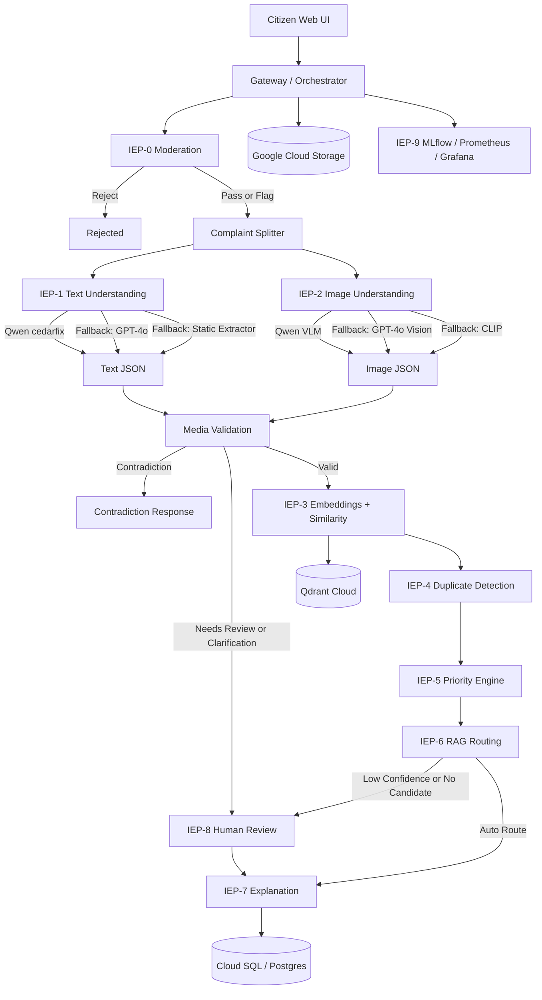

# CedarFix AI Final System Documentation

## 1. System Purpose

CedarFix AI is a multimodal public-infrastructure complaint intelligence system for Lebanon. It accepts citizen complaints that may contain text, an image, or both. The system understands the complaint, validates whether the text and image refer to the same issue, detects duplicates, scores priority, routes the complaint to the correct responsible entity, and exposes audit/monitoring data for operations and model improvement.

The production-oriented branch is designed for Google Cloud Platform. The application runs on GKE, persists structured data in Cloud SQL/Postgres, stores uploaded images and large audit artifacts in Google Cloud Storage, stores embeddings and routing knowledge in Qdrant Cloud, and uses MLflow, Prometheus, and Grafana for auditability and monitoring.

The system is built around a sequence of Intelligence Engine Processors, called IEPs. Each IEP has a clear responsibility and a fallback strategy so the pipeline can keep producing a safe decision even when one model or service fails.

## 2. High-Level Runtime Architecture

The deployed system is split into grouped services:

- `frontend`: browser UI for citizens, dashboard, admin review, and complaint tracking.
- `api-service`: gateway/orchestrator plus priority, explanation, and review services.
- `ai-service`: text understanding, embeddings, duplicate/clustering, and routing services.
- `vision-service`: image understanding service.
- `postgres`: local only in Docker; in GCP this is replaced by Cloud SQL/Postgres through Cloud SQL Proxy.
- `qdrant`: local only in Docker; in GCP this is Qdrant Cloud.
- `prometheus`: metrics collection.
- `grafana`: dashboards for service health and pipeline metrics.
- `mlflow`: LLM audit and prompt/version tracking.

External production dependencies:

- Google Kubernetes Engine for running the application pods.
- Cloud SQL/Postgres for durable relational storage.
- Google Cloud Storage for complaint images and large audit artifacts.
- Qdrant Cloud for vector search and routing knowledge retrieval.
- RunPod-hosted Qwen text endpoint.
- RunPod-hosted Qwen VLM endpoint.
- OpenAI GPT-4o for translation and fallback extraction.

## 3. Production Configuration Summary

Current GCP-facing configuration values used by the Kubernetes profile:

- Storage backend: `gcs`
- GCS bucket: `cedarfix-prod-images-sleiman`
- Qdrant URL: `https://3ce76d84-8dc2-4da6-a043-1ce1e25ad3cc.us-east4-0.gcp.cloud.qdrant.io`
- Main Qdrant complaint collection: `complaints`
- Text embedding collection: `text_embeddings`
- CLIP embedding collection: `clip_embeddings`
- Routing RAG collection: `routing_knowledge`
- Text embedding model: `sentence-transformers/paraphrase-multilingual-mpnet-base-v2`
- CLIP model: `openai/clip-vit-base-patch32`
- Qwen text base URL: `https://pt63iegwl1al00-8000.proxy.runpod.net/v1`
- Qwen text model: `cedarfix`
- VLM base URL: `https://70pjp4ssi40ij0-8000.proxy.runpod.net/v1`
- VLM model: `Qwen/Qwen2.5-VL-3B-Instruct`
- OpenAI fallback model: `gpt-4o`
- Media alignment model: `cedarfix`
- MLflow tracking URI inside cluster: `http://mlflow`
- Auto-route threshold: `0.85`
- Human review threshold: `0.65`
- Duplicate threshold: `0.92`
- Near-duplicate threshold: `0.78`
- Routing RAG enabled: `true`
- Duplicate LLM judge enabled: `true`
- Moderation enabled: `true`

Secrets such as OpenAI API keys, Qdrant API keys, database credentials, and RunPod API keys belong in Kubernetes Secrets, not inside source code or container images.

## 4. Model Inventory

### 4.1 `cedarfix` Text Model

`cedarfix` is the fine-tuned text-understanding model used by the system. It is a fine-tuned Qwen 3B Instruct model. The fine-tuning uses LoRA weights stored on Hugging Face. In production, the model is served from a RunPod OpenAI-compatible endpoint.

Primary uses:

- Text complaint extraction.
- Complaint splitting.
- Media alignment judge when comparing text and image.
- Routing judge when selecting the responsible authority from RAG candidates.
- Duplicate judge when LLM adjudication is enabled.
- Text moderation or classification checks where configured.

The model is expected to return strict JSON matching the CedarFix complaint schema. The key purpose is not to produce natural-language answers, but to produce structured fields that downstream services can rely on.

### 4.2 Qwen VLM

The VLM model is `Qwen/Qwen2.5-VL-3B-Instruct`, served on RunPod through an OpenAI-compatible endpoint.

Primary uses:

- Image complaint understanding.
- Visual issue detection.
- Image captioning.
- Extraction of up to three visual issue candidates when an image contains multiple issues.
- Visual routing features such as physical component, failure mode, hazard type, visible objects, and location cues.

### 4.3 GPT-4o

GPT-4o is used as a controlled fallback model, not as the default path for every request.

Primary uses:

- Arabizi or difficult mixed-language translation to English before sending text to Qwen.
- Text extraction fallback if Qwen text understanding fails.
- Vision fallback if Qwen VLM fails.
- Emergency fallback for schema-compatible JSON when the primary hosted models are unavailable.

Important design decision: for Arabizi or mixed-language input, GPT-4o should translate the input to English only. The translated English text is then processed by the fine-tuned `cedarfix` Qwen model. GPT-4o should not replace Qwen as the main extractor unless Qwen fails.

### 4.4 MPNet Text Embeddings

The model `sentence-transformers/paraphrase-multilingual-mpnet-base-v2` is used for semantic text embeddings.

Primary uses:

- Complaint text similarity.
- Routing RAG retrieval.
- Semantic duplicate candidates.
- Similarity between text complaint content and generated image captions.

### 4.5 CLIP

The model `openai/clip-vit-base-patch32` is used for cross-modal image and text embeddings.

Primary uses:

- Direct image embeddings.
- CLIP text embeddings from English complaint text.
- CLIP text embeddings from image captions.
- Text-to-image similarity.
- Image-to-image similarity.
- Fallback image understanding when VLM and GPT-4o vision are unavailable.

CLIP embeddings are semantic, but they are not the same as full reasoning. CLIP can recognize broad visual/text alignment such as "pothole in road" matching an image of a pothole. It is weaker for fine routing, detailed authority assignment, and nuanced contradictions. For these cases, the system uses VLM JSON and LLM judging.

## 5. Input and Storage Flow

Input can include:

- Original user text.
- Optional uploaded image.
- Optional metadata such as user account, timestamp, and location hints.

Durable storage:

- Cloud SQL/Postgres stores complaints, users, structured decisions, audit rows, review queues, retraining records, and routing decisions.
- GCS stores uploaded complaint images and large audit artifacts.
- Qdrant Cloud stores vectors for complaint similarity and routing knowledge.
- MLflow stores prompt/version metadata and audit artifacts for LLM calls.

The system should not depend on container filesystem storage for durable production data. Pod storage is temporary and must be treated as disposable.

## 6. IEP Pipeline Overview

The gateway orchestrator runs the complaint through the IEPs in order. Some stages run in parallel for latency.

Pipeline order:

1. IEP-0 moderation.
2. Complaint splitting if needed.
3. IEP-1 text understanding and IEP-2 image understanding in parallel.
4. Media validation gate.
5. IEP-3 embeddings and similarity.
6. IEP-4 duplicate detection.
7. IEP-5 priority scoring.
8. IEP-6 routing.
9. IEP-7 explanation.
10. IEP-8 human review when needed.
11. IEP-9 monitoring and audit across all stages.

If a hard rejection happens at moderation or media validation, the pipeline stops early. If uncertainty happens, the complaint is routed to human review rather than silently accepted.

## 7. IEP-0: Moderation

IEP-0 protects the system before expensive downstream processing.

Responsibilities:

- Detect spam, abuse, unsafe content, irrelevant content, and AI-generated-image flags where configured.
- Decide whether to pass, flag, or reject a submission.
- Avoid spending LLM and VLM resources on clearly invalid submissions.

Output:

- `status`: `pass`, `flag`, or `reject`
- `flags`: list of moderation reasons
- `risk_score`
- `reason`
- `action`

Fallback behavior:

- Rule-based moderation runs even if LLM moderation is unavailable.
- If moderation cannot confidently reject, the safer action is usually to pass with flags or send to review, not to discard a potentially valid complaint.

## 8. Complaint Splitting

Before or during orchestration, the gateway may split a submission into separate complaint candidates.

Responsibilities:

- Detect whether the user submitted multiple unrelated complaints in one text.
- Split them into independent complaint units when needed.
- Preserve the original text and link split outputs to the original submission.

Model path:

- Primary: Qwen `cedarfix` splitter.
- Fallback: heuristic splitter.
- Final fallback: treat the whole submission as one complaint.

This prevents one input such as "there is a pothole and also electricity outage" from being routed to only one authority.

## 9. IEP-1: Text Understanding

IEP-1 extracts structured meaning from the citizen text.

Responsibilities:

- Detect whether the text is a real complaint.
- Translate or normalize the text into English.
- Extract issue type, category, subcategory, severity, and summary.
- Extract location mentions and location context.
- Extract routing features such as domain, physical component, failure mode, hazard type, and emergency signal.
- Extract evidence and missing information.
- Produce canonical structured JSON for downstream services.

Expected important fields:

- `is_complaint`
- `english_translation`
- `summary`
- `issue_type`
- `category`
- `subcategory`
- `severity`
- `location`
- `location_mentions`
- `keywords`
- `signals`
- `routing_features`
- `evidence`
- `alignment_features`
- `semantic_domain`
- `physical_component`
- `failure_mode`
- `confidence`

Primary model flow:

1. Detect language and mixed-language conditions.
2. If the text is Arabizi or difficult mixed-language, call GPT-4o only to translate to English.
3. Send the English text to the fine-tuned Qwen `cedarfix` model.
4. Parse and validate the JSON response.
5. Normalize fields into CedarFix internal schemas.

Fallback flow:

1. Qwen `cedarfix` extraction is attempted first.
2. If Qwen fails, GPT-4o is called with the same CedarFix JSON schema and prompt intent.
3. If GPT-4o fails, a static/rule-based extractor produces a conservative structured result.
4. If even the static extractor is uncertain, the complaint is sent to human review rather than trusted blindly.

Important edge case:

If the text is vague, such as "please fix it", the text model may not detect a complaint by itself. If the image clearly shows a complaint with high confidence, the system should not automatically reject. It should send the case to human review or ask for clarification depending on the media validation result.

## 10. IEP-2: Image Understanding

IEP-2 extracts structured meaning from an uploaded image.

Responsibilities:

- Detect whether an image exists.
- Assess image quality.
- Detect public infrastructure issues visible in the image.
- Generate a caption.
- Return visual complaint candidates.
- Extract visual category, subcategory, severity, objects, hazards, location cues, and routing features.
- Produce direct CLIP image embeddings.

Important output fields:

- `image_present`
- `quality`
- `visual_understanding`
- `vlm_analysis`
- `visual_candidates`
- `caption`
- `image_embedding`
- `clip_text_embedding`
- `semantic_domain`
- `physical_component`
- `failure_mode`
- `public_safety_risk`
- `evidence`
- `alignment_features`

Primary model flow:

1. The system processes the image and creates a CLIP image embedding.
2. The Qwen VLM analyzes the image and returns structured JSON.
3. If the image contains multiple issues, the VLM can return up to three visual candidates.
4. The highest-confidence candidate is used by default, unless text alignment selects a different candidate.

Fallback flow:

1. Qwen VLM is the primary visual understanding model.
2. If Qwen VLM fails, GPT-4o vision is used with the same expected CedarFix image JSON schema.
3. If GPT-4o vision also fails, CLIP-based image understanding remains as the final fallback.

CLIP fallback is useful for broad categories and similarity, but it is less reliable than VLM JSON for detailed issue extraction and routing.

## 11. Multi-Issue Image Handling

Images can contain more than one issue. For example, one image may contain a pothole, illegal dumping, and a broken streetlight.

The VLM can return up to three issue candidates:

- Candidate 1: highest confidence or most visually central issue.
- Candidate 2: second visible issue.
- Candidate 3: third visible issue.

Selection rules:

- If text is informative and matches one image candidate, that candidate becomes the actual complaint.
- If text is informative and matches none of the image candidates, the case becomes a contradiction or human-review case.
- If text is not informative and the image has one clear issue, the image issue can drive routing with a review flag if confidence requires it.
- If text is not informative and the image has multiple distinct issues, the system should avoid auto-routing because routing becomes ambiguous. It should send the case to human review or ask the user to clarify which issue they want to report.
- If the image is low quality, the system lowers confidence and prefers human review or clarification.

This prevents the system from auto-routing one submission to the wrong authority when the image contains several unrelated problems.

## 12. Media Validation Gate

After IEP-1 and IEP-2, the gateway validates whether text and image agree.

Responsibilities:

- Compare text issue against image issue.
- Compare semantic domain, physical component, failure mode, object/action signals, and location context.
- Use visual candidates when the image has multiple issues.
- Decide whether the combined complaint is valid, contradictory, unclear, or review-worthy.

Possible statuses:

- `valid`: text and image match or do not conflict.
- `contradiction`: text describes one issue and image clearly shows a different issue.
- `needs_clarification`: user input is too vague or ambiguous.
- `human_review`: machine decision is uncertain.
- `invalid_no_complaint`: neither text nor image contains a real complaint.

Model and fallback behavior:

- First pass uses deterministic comparison of structured fields.
- If available and needed, Qwen `cedarfix` is used as the LLM media alignment judge.
- If the LLM judge fails, deterministic overlap and CLIP similarity are used as fallback.
- If the result is still uncertain, the complaint goes to human review.

Important behavior:

- If text is not a complaint but image is a clear complaint, the system should not pretend the text complaint is the image complaint. It should show the text as `unknown` or non-complaint and send the case to clarification or review unless policy allows image-only routing.
- If text and image contradict each other, the response should explain the contradiction and avoid continuing with normal duplicate/routing as if everything matched.

## 13. IEP-3: Embeddings and Similarity

IEP-3 creates vector representations and retrieves similar historical complaints.

Responsibilities:

- Build a canonical complaint text from the English translation, summary, issue type, category, and location.
- Generate MPNet text embeddings.
- Generate CLIP text embeddings from the English text.
- Generate CLIP text embeddings from the image caption when available.
- Store direct CLIP image embeddings.
- Query Qdrant for similar text and image complaints.
- Return candidates for duplicate detection and clustering.

Embedding types used:

- MPNet embedding of English complaint text.
- CLIP text embedding of English complaint text.
- CLIP text embedding of VLM-generated image caption.
- CLIP image embedding of the raw image.

Why English translation is used:

- It creates a stable semantic representation across Arabic, Arabizi, French, and English.
- It avoids comparing raw mixed-language text against English captions or routing data.
- It improves duplicate matching and routing retrieval.

Why image caption embeddings are useful:

- They let the system compare a text-only complaint against past image-only complaints.
- They improve duplicate detection when one complaint has an image and the other has only text.
- They help bridge the gap between VLM output and text embeddings.

Fallback behavior:

- If MPNet embedding fails, CLIP text/image similarity can still produce candidates.
- If CLIP fails, MPNet text search can still work for text-based complaints.
- If all embedding paths fail, the system continues with lower confidence and human-review eligibility.

## 14. Text-Image Similarity

The system uses multiple signals to decide whether image and text are similar:

- Text semantic domain compared with image semantic domain.
- Text physical component compared with image physical component.
- Text failure mode compared with image failure mode.
- Text issue type compared with visual category/subcategory.
- Text objects/actions compared with visual objects/actions.
- Location mentions compared with image location cues when available.
- CLIP similarity between English text and raw image.
- CLIP similarity between English text and VLM caption.
- MPNet similarity between English text and VLM caption.
- LLM media alignment judge when deterministic and embedding signals are inconclusive.

The JSON output from Qwen or VLM is not ignored. It is used heavily for routing features, media validation, and duplicate scoring. Embeddings are a complementary semantic signal, not the only decision source.

## 15. IEP-4: Duplicate Detection and Clustering

IEP-4 determines whether a new complaint is a duplicate or near-duplicate of an existing one.

Responsibilities:

- Compare the new complaint against retrieved candidates.
- Combine text similarity, image similarity, caption similarity, issue similarity, location similarity, and time proximity.
- Mark exact duplicates and near-duplicates.
- Link complaints into clusters when they refer to the same real-world issue.
- Use an LLM duplicate judge when enabled for ambiguous high-impact cases.

Thresholds:

- Duplicate: `0.92`
- Near duplicate: `0.78`

Signals used:

- MPNet text similarity.
- CLIP text similarity.
- Direct CLIP image similarity.
- Text-to-image CLIP similarity.
- Caption-to-text MPNet similarity.
- Issue type similarity.
- Category/subcategory similarity.
- Semantic domain similarity.
- Physical component similarity.
- Failure mode similarity.
- Location similarity.
- Time similarity.

Location-aware duplicate behavior:

Duplicate detection should not rely only on semantic text. Two users can submit the same wording from different places, such as "there is a pothole" in Zalka and "there is a pothole" in Zahle. These should not automatically be duplicates.

The correct strategy is:

- Use location as a strong filter or penalty.
- Prefer comparing a new complaint against candidates in the same normalized location or nearby area.
- If locations conflict clearly, reduce duplicate confidence heavily.
- If location is missing in either complaint, do not reject duplicate matching completely, but lower confidence.
- If two complaints have the same issue and similar media but different locations, send to human review instead of auto-merging.

LLM judge behavior:

- If enabled, Qwen `cedarfix` can judge whether two candidates describe the same real-world incident.
- The judge should receive normalized issue fields, summaries, location, timestamps, and media captions.
- If the LLM judge fails, deterministic scoring remains the fallback.

## 16. IEP-5: Priority Engine

IEP-5 scores urgency and severity.

Responsibilities:

- Convert extracted text/image severity into operational priority.
- Increase priority for public safety and emergency signals.
- Increase priority for fire, electrical hazards, road blockages, flooding, or traffic impact.
- Consider duplicate cluster size and growth rate.
- Consider location risk when available.

Inputs:

- Text severity.
- Image severity.
- Emergency signal.
- Public safety risk.
- Traffic impact.
- Hazard type.
- Complaint category.
- Duplicate/cluster information.
- Location context.

Output:

- `severity`
- `priority_score`
- `priority_rank`
- `reasons`
- `recommended_response_time`

Fallback behavior:

- Priority is mostly rule-based and remains available even if LLMs fail.
- If key inputs are missing, it uses conservative defaults and can flag the complaint for review.

## 17. IEP-6: Routing Engine

IEP-6 chooses the responsible authority or entity.

Responsibilities:

- Retrieve relevant routing knowledge from Qdrant RAG.
- Compare complaint features with official/service routing documents.
- Select the primary responsible entity.
- Optionally select secondary entities.
- Decide whether the complaint can be auto-routed or needs human review.

Routing knowledge source:

- Qdrant collection: `routing_knowledge`
- Embedding model: `sentence-transformers/paraphrase-multilingual-mpnet-base-v2`
- Top K: `5`

Routing stages:

- Stage 1: dispatch or high-level authority selection.
- Stage 2: operational unit or more specific routing.
- Stage 3: evidence/checklist requirements.

Primary routing model:

- Qwen `cedarfix` is used as the routing judge when selecting from RAG candidates.

Routing rules:

- The router must not invent unsupported authorities.
- It must choose only from retrieved candidates when RAG is enabled.
- Support docs, fallback docs, manual-only docs, and audit docs cannot be used as direct auto-route authorities.
- If no RAG candidates are retrieved, routing becomes `rag_no_candidates` and the complaint requires human review.
- If confidence is below `0.65`, review is required.
- If confidence is at least `0.85` and no review rule is triggered, the complaint can be auto-routed.

Routing output fields:

- `primary_entity`
- `primary_confidence`
- `secondary_entity`
- `secondary_confidence`
- `retrieved_sources`
- `retrieved_candidates`
- `routing_source`
- `auto_routed`
- `requires_review`
- `review_reason`
- `rag_no_candidates`

Static fallback:

- A legacy static routing map can exist for local/dev use.
- In GCP production, RAG routing is the expected path.
- If RAG is disabled and static fallback is also disabled, routing must go to human review.

## 18. IEP-7: Explanation Engine

IEP-7 produces a user/admin-readable explanation of the decision.

Responsibilities:

- Explain why the complaint was accepted, rejected, contradicted, duplicated, routed, or sent to review.
- Summarize the key evidence used by the pipeline.
- Include priority and routing reasons.
- Keep explanations consistent with structured decisions.

Output:

- `explanation_text`
- `mode`
- `key_factors`
- `citizen_message`
- `admin_summary`

Fallback behavior:

- Explanation is template-based in the MVP path.
- If upstream data is incomplete, it still generates a conservative explanation using available status, routing, duplicate, and review fields.

## 19. IEP-8: Human Review and Active Learning

IEP-8 handles cases that should not be trusted to full automation.

Human review triggers:

- Text/image contradiction.
- Text is vague but image shows a complaint.
- Image has multiple unrelated issues and text does not disambiguate.
- Low model confidence.
- Low routing confidence.
- No RAG candidates for routing.
- Duplicate decision is ambiguous.
- Location conflict in duplicate candidates.
- Low-quality image.
- Moderation flags that are not severe enough for rejection.

Review service responsibilities:

- Store review queue items.
- Allow admin corrections to text understanding.
- Allow admin corrections to image understanding.
- Allow admin corrections to routing.
- Allow admin duplicate/merge decisions.
- Store corrected examples for retraining.

Active learning:

- Human corrections become gold examples.
- Corrected JSON can be exported for future fine-tuning of `cedarfix`.
- Routing corrections can improve RAG data.
- Duplicate corrections can improve thresholds and judge prompts.

## 20. IEP-9: Monitoring, Audit, and Prompt Versioning

IEP-9 is not one model call. It is the observability layer across the system.

Responsibilities:

- Collect service metrics.
- Track pipeline latency.
- Track LLM calls and failures.
- Store prompt versions.
- Store request/response audit artifacts.
- Support debugging of failed extractions, routing mistakes, and model drift.

Tools:

- Prometheus for metrics collection.
- Grafana for dashboards.
- MLflow for prompt/version metadata and LLM audit runs.
- Postgres for production audit rows.
- GCS for large audit artifacts.

LLM audit records include:

- Complaint ID.
- Service name.
- Provider.
- Model name.
- Prompt version.
- Request payload.
- Raw output.
- Parsed output.
- Latency.
- Status.
- Error message when failed.

Expected MLflow artifacts:

- `request_payload.json`
- `raw_output.txt`
- `parsed_output.json`
- `audit_metadata.json`

Important behavior:

- MLflow logging must be non-fatal. A failed MLflow artifact upload should not break complaint processing.
- Production audit should still be stored in Postgres/GCS even if MLflow is unavailable.
- Prompt versions should be stable strings such as `text_extraction_v3`, `vlm_image_analysis_v2`, `routing_judge_v1`, or `media_alignment_v1`.

### Offline GPT-4o LLM-as-Judge Evaluation

The monitoring service includes an offline evaluation subsystem named Daily GPT-4o LLM-as-Judge Evaluation Service. This subsystem is explicitly not part of the complaint processing pipeline and must never influence text understanding, image understanding, media validation, duplicate detection, priority, routing, or explanation.

Purpose:

- Quality monitoring.
- MLflow analytics.
- Research and thesis evaluation.
- Model comparison across CedarFix versions.

Schedule:

- Runs daily at midnight using `EVALUATION_TIMEZONE`, default `Asia/Beirut`.
- Selects a random 20 percent sample of complaints created during the previous day.
- Processes complaints in batches of 10.
- Sends each batch to GPT-4o using the current judge prompt version. The initial version was `evaluation_judge_v1`; `evaluation_judge_v2` added stricter consistency checks; `evaluation_judge_v3` adds hard-cap instructions for generic routing, unrelated secondary authorities, severity mismatches, and review/explanation mismatches.
- Stores GPT-4o returned scores and reasoning in Postgres table `complaint_evaluations`.
- Publishes Prometheus metrics for average routing score, average extraction score, average overall score, and evaluation count.
- Logs each evaluation batch to MLflow experiment `cedarfix/evaluation_judge`.

Critical boundary:

- GPT-4o executes the rubric and produces all scores.
- Backend code does not compute per-complaint text, image, routing, explanation, media validation, or overall scores.
- Backend code only gathers data, builds prompts, sends requests, validates returned JSON, stores results, and aggregates already-returned scores for monitoring.

Judge input per complaint:

- Original complaint text.
- Original image URL if present.
- Text JSON.
- Image JSON.
- Media validation result.
- Routing result.
- Explanation result.
- Final complaint decision.

Judge output per complaint:

- `text_understanding.score`, reason, and errors.
- `image_understanding.score`, reason, and errors.
- `media_validation.score`, reason, and errors.
- `routing.score`, reason, and errors.
- `explanation.score`, reason, and errors.
- `overall_decision.score`, reason, and errors.

Storage:

- Table: `complaint_evaluations`.
- Main fields: `complaint_id`, `evaluated_at`, `judge_model`, `prompt_version`, component scores, `overall_score`, and `reasoning_json`.

Operational endpoints:

- `GET /evaluation/status` on monitoring service returns stored aggregate evaluation metrics.
- `POST /evaluation/run` manually triggers the offline evaluator in the background.

## 21. Fallback Matrix

| Stage | Primary | Fallback 1 | Fallback 2 | Final Safety Behavior |
| --- | --- | --- | --- | --- |
| Moderation | Rule-based plus configured LLM/VLM checks | Rule-based only | Pass with flags | Human review or reject only when confident |
| Translation | GPT-4o for Arabizi/mixed-language translation | Original text if already English/French/Arabic | Heuristic normalization | Send normalized text to Qwen |
| Text understanding | Qwen `cedarfix` | GPT-4o same JSON schema | Static/rule-based extractor | Human review if uncertain |
| Image understanding | Qwen VLM | GPT-4o vision same JSON schema | CLIP image/text similarity | Human review if uncertain |
| Media validation | Structured comparison plus Qwen judge | CLIP/MPNet similarity | Rule-based overlap | Contradiction, clarification, or review |
| Embeddings | MPNet plus CLIP | MPNet only | CLIP only | Continue with reduced confidence |
| Duplicate detection | Multimodal scoring plus LLM judge | Multimodal deterministic scoring | Text-only or image-only scoring | Human review if ambiguous |
| Priority | Rule-based priority engine | Conservative defaults | Review flag | Never block pipeline only because priority is uncertain |
| Routing | Qdrant RAG plus Qwen judge | RAG deterministic candidate scoring | Static fallback if explicitly enabled | Human review if no candidates or low confidence |
| Explanation | Template explanation | Minimal status explanation | Admin-only fallback reason | Keep user-facing output safe and consistent |
| Audit | Postgres/GCS plus MLflow | Postgres/GCS only | Application logs | Audit failure must not break user flow |

## 22. Routing Examples

### Fire in Building

Input:

- Text: "The fire is rising from a building in Zalka"
- Image: building fire or smoke

Expected behavior:

- Text understanding extracts fire/building/emergency/public safety risk.
- Image understanding detects fire/building/smoke.
- Media validation returns valid.
- Priority becomes high or critical.
- Routing RAG should select the relevant fire/emergency/civil defense authority from retrieved knowledge.
- If route confidence is high enough, auto-route.
- If the retrieved authority is missing or ambiguous, send to human review.

### Vague Text with Pothole Image

Input:

- Text: "please fix it"
- Image: pothole in road

Expected behavior:

- Text understanding may return unknown or low-confidence non-specific complaint.
- Image understanding detects pothole.
- Media validation should not reject automatically.
- If image confidence is high, send to human review or clarification because the text intent is vague.
- If policy allows image-only complaints, route based on image but keep a review flag.

### Text and Image Contradiction

Input:

- Text: "water outage in the neighborhood"
- Image: yellow traffic light

Expected behavior:

- Text issue is water outage.
- Image issue is traffic signal.
- Media validation returns contradiction.
- Pipeline stops before normal routing.
- User/admin sees a contradiction message.

### Same Issue in Different Locations

Input:

- Complaint A: pothole in Zalka.
- Complaint B: pothole in Zahle.

Expected behavior:

- Semantic embeddings may be similar.
- Location comparison should reduce duplicate score.
- They should not be auto-merged as duplicates.
- If other evidence is confusing, send to human review.

## 23. Data Quality Expectations

Fine-tuning data should match the exact JSON schema expected by the production system. The `english_translation` field should contain the actual English complaint text used by embeddings and routing.

Good fine-tuning examples should include:

- Positive complaint examples across electricity, water, roads, telecom, waste, safety, and municipal issues.
- Negative examples where `is_complaint` is false, such as greetings, personal messages, jokes, unrelated comments, or general questions.
- Vague examples such as "please fix it" with the correct low-confidence or missing-information behavior.
- Multi-language examples in Arabic, English, French, and Arabizi.
- Location-rich examples.
- Examples with missing information.
- Edge cases where severity should not be exaggerated.

If every training row has `is_complaint: true`, the model can overpredict complaints. The system should include false/non-complaint examples and human-review logic to reduce false alarms.

## 24. Current Deployment Readiness Notes

The architecture is suitable for GCP deployment when the following are true:

- Containers do not store durable data locally.
- Cloud SQL is used for relational persistence.
- GCS is used for images and large audit artifacts.
- Qdrant Cloud is seeded with routing knowledge and complaint vector collections.
- Kubernetes Secrets contain runtime credentials.
- RunPod Qwen and VLM endpoints are reachable.
- OpenAI API key is configured for translation and fallbacks.
- Prometheus, Grafana, and MLflow services are reachable.
- Cloud SQL Proxy is running in pods that need database access.

Known operational risk:

- RunPod proxy URLs can change. If they change, update the Kubernetes ConfigMap/Secret and restart the affected deployments. Do not rebuild images just to change model URLs.
- If MLflow/Grafana/Prometheus are exposed publicly without auth, they are acceptable only for temporary testing. Production should add authentication or private access.
- GPT-4o fallback can increase cost if Qwen or VLM are down. Monitoring should alert on fallback rate.

## 25. Mermaid System Diagram

## 26. Practical Debugging Guide

When a complaint behaves incorrectly, check in this order:

1. Complaint row in Postgres and `full_decision_json`.
2. Text understanding output.
3. Image understanding output.
4. Media validation result.
5. Embedding/similarity strategy and candidates.
6. Duplicate result and duplicate score components.
7. Routing retrieved candidates and selected entity.
8. Human review queue reason.
9. MLflow audit run for request payload, raw model output, parsed JSON, and latency.
10. Service logs for gateway, text understanding, image understanding, routing, and MLflow artifact errors.

For text extraction failures in MLflow:

- Check whether the actual complaint pipeline succeeded even if MLflow marked the run failed.
- A run can show failed if artifact logging failed after the model call succeeded.
- Check the audit tags and artifacts before assuming Qwen failed.
- Ensure the MLflow pod has access to its artifact storage and that services have the right MLflow tracking URI.

For dashboard mismatch:

- The dashboard should display text understanding from text JSON, not from image JSON.
- Contradiction responses should not overwrite the text issue with the image issue.
- If the text is non-complaint, the UI should show unknown/non-complaint for text and the visual issue separately for image.

## 27. Final Design Principle

CedarFix should automate only when the evidence is strong. The system should use fine-tuned Qwen for structured text extraction, Qwen VLM for structured image understanding, embeddings for semantic retrieval, RAG for authority routing, and human review whenever text/image alignment, location, duplicate status, or routing confidence is uncertain.
